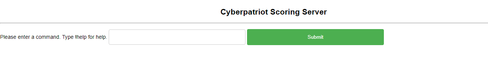
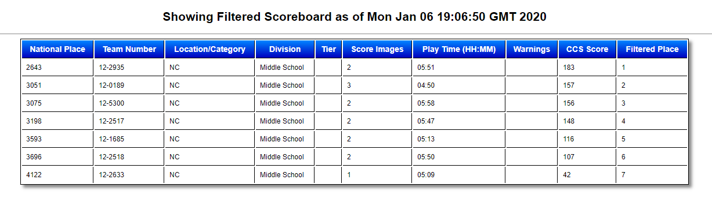

# CyberScoreServer
## Setup
A java servlet based scoreboard parsing and filtering application. For deployment, I recommend using Eclipse for Java EE Developers and the Azure Web Application add-on to Eclipse for seamless transfer to a free Azure for Students web server. Of course, uploading this straight to your Tomcat server also works.

After installation on server, go to `/board-admin` to setup scoreboard URL and the team prefix (ex. 12-). IF this is not done, errors when loading pages will occur.

## Commands
#### !team <last four of team ID> - show team ID
  ex. `!team 1301`
#### !monitor <last four of team ID> <last four of another team ID> (coming soon) - monitor two teams with notifications
  ex. `!monitor 3010 0045`
#### !scoreboard <parm1> <parm2> <parm3> - parm options can be in any order and either a state abbreviation, tier, or division - shows a filtered view of the public scoreboard
  ex. `!scoreboard NC AS Gold`
  ex. `!scoreboard MS NC`
  ex. `!scoreboard Open NC`
  ##### Order of parameters does NOT matter
#### !help - for help page

## Examples
### Home Page

### Filtered View (ex. MS teams in NC)

